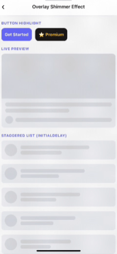
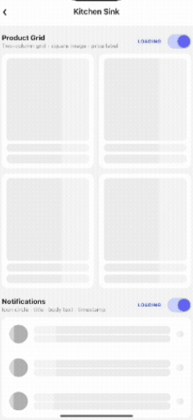

<div align="center">


# Compose Auto Shimmer

### Stop hand-coding skeleton screens. Your UI is your skeleton.

[](https://search.maven.org/)
[](https://developer.android.com/jetpack/compose)
[](LICENSE)
[](https://www.android.com/)
[](CONTRIBUTING.md)

<br/>

**⭐ If this saves you time, star the repo — it takes 2 seconds and helps others find it.**

<br/>

<table>
<tr>
<td align="center" width="33%">

**ShimmerBox**


</td>
<td align="center" width="33%">

**ShimmerOverlay**



</td>
<td align="center" width="33%">

**ShimmerPlaceholder**



</td>
</tr>
<tr>
<td align="center">Auto wrapper — zero manual work</td>
<td align="center">Sweep over any element</td>
<td align="center">Fixed-size skeleton boxes</td>
</tr>
</table>

</div>

---

## 🤦 The problem with skeleton screens today

Every Android developer has been there:

```kotlin
🤦 "OK let me eyeball this card width... maybe 340dp? Let me check on a different device..."
🤦 "The design changed again. Rebuild all the skeletons (the fake boxes)."
🤦 "Why does the skeleton not match the real layout on foldables or tablets?"
```

Building skeletons by hand is a time sink that should not exist. **ComposeAutoShimmer fixes this permanently.** 

---

## ✨ Three ways to use it

<div align="center">

| | **ShimmerBox** ⭐ Primary | **ShimmerOverlay** | **ShimmerPlaceholder** |
|---|---|---|---|
| **What** | Skeleton from live UI, zero manual work | Shimmer sweep over any element | Fixed-size shimmer box |
| **Logic** | Measured from real components | Wraps whatever you give it | You set `width` / `height` |
| **Responsive** | ✅ % widths, any screen | — | ❌ Fixed dp |
| **Setup** | **Zero.** Just wrap your UI | Wrap & go | Drop in |
| **Use when** | Building loading screens | Shine/highlight effects | Simple one-off placeholders |

</div>

> **Start with ShimmerBox.** Drop to the manual options only for quick one-offs or pure visual effects.

---

## 🛠 Installation

### 1. Add the JitPack repository
Add it in your root `settings.gradle` or `settings.gradle.kts` at the end of repositories:

<details open>
<summary>Kotlin DSL (settings.gradle.kts)</summary>

```kotlin
dependencyResolutionManagement {
    repositoriesMode.set(RepositoriesMode.FAIL_ON_PROJECT_REPOS)
    repositories {
        mavenCentral()
        maven { url = uri("https://jitpack.io") }
    }
}
```
</details>

<details>
<summary>Groovy (settings.gradle)</summary>

```groovy
dependencyResolutionManagement {
    repositoriesMode.set(RepositoriesMode.FAIL_ON_PROJECT_REPOS)
    repositories {
        mavenCentral()
        maven { url 'https://jitpack.io' }
    }
}
```
</details>

### 2. Add the dependency
Add the following to your module-level `build.gradle` or `build.gradle.kts`:

```kotlin
dependencies {
    // Flagship "Zero-Touch" Shimmer Engine
    implementation("com.github.ChFardeelAzhar:compose-auto-shimmer:1.0.1")
}
```

> Built entirely on the native Graphics Layer · Zero third-party dependencies · Performance optimized for 60fps

---

# 🚀 ShimmerBox ⭐

> The flagship "Zero-Touch" engine. It silhouettes your real UI at runtime — no measurement, no guesswork, no drift.

## Before vs. After

```diff
- // 😩 The old, painful way
- @Composable
- fun SkeletonCard() {
-     Column {
-         Box(modifier = Modifier.size(340.dp, 180.dp).background(Color.LightGray)) 
-         Box(modifier = Modifier.size(280.dp, 18.dp).background(Color.LightGray).padding(top = 16.dp))
-     }
- }

+ // ✅ With ComposeAutoShimmer
+ ShimmerBox(isLoading = loading) {
+     ArticleCard() // Captured automatically!
+ }
```

## How it works (The "Magic" Explained)

`ShimmerBox` doesn't just draw a box. It performs a real-time **X-Ray Capture** of your Composable tree:

1.  **Theme Hijacking**: It injects a temporary `MaterialTheme` override that makes component backgrounds (Cards, Surfaces) transparent but keeps content (Text, Icons) solid.
2.  **Morphological Filling**: It uses a proprietary "Blur & Crush" filter. It blurs thin lines (like icons) so they merge, then sharpens them into solid shimmering blocks.
3.  **Silhouette Casting**: It casts a shadow of your entire UI on a hardware-accelerated layer and applies a high-fidelity 5-stop gradient sweep.

---

## ⚙️ Configuration

### Global Defaults
Wrap your app in `ShimmerTheme` to set the look and feel globally.

```kotlin
val myConfig = ShimmerConfig(
    baseColor = Color(0xFFBDBDBD),
    highlightColor = Color.White,
    durationMillis = 1200,
    angleDegrees = 20f
)

ShimmerTheme(config = myConfig) {
    AppNavigation()
}
```

### Local Overrides
You can also override per-instance:

```kotlin
ShimmerBox(
    isLoading = true,
    baseColor = Color.DarkGray,
    durationMillis = 800
) {
    MyComponent()
}
```

---

## 📖 API Reference

### `<ShimmerBox>`
The main entry point for automatic skeletonization.

| Prop | Type | Default | Description |
|------|------|---------|-------------|
| `isLoading` | `Boolean` | **required** | Toggle between skeleton and real UI |
| `modifier` | `Modifier` | `Modifier` | Outer container modifier |
| `baseColor` | `Color` | `ShimmerDefaults.BaseColor` | Color of the skeleton bars/shapes |
| `highlightColor` | `Color` | `ShimmerDefaults.HighlightColor` | Color of the shimmer glint |
| `durationMillis` | `Int` | `1200` | Duration of one sweep cycle |
| `content` | `@Composable` | — | Your real UI content |

### `<ShimmerOverlay>`
Adds a shimmer "shine" on top of existing visible content.

| Prop | Type | Default | Description |
|------|------|---------|-------------|
| `active` | `Boolean` | `true` | Whether the animation runs |
| `angleDegrees` | `Float` | `20f` | Angle of the sweep band |

---

## ❓ FAQ

<details>
<summary><strong>Do I need to keep ShimmerBox in production?</strong></summary>

Yes — but it has Zero overhead. When `isLoading = false`, it acts as a simple pass-through `Box`. It only activates its graphics layer when loading.
</details>

<details>
<summary><strong>Why are my icons still drawing as lines?</strong></summary>

Check your `baseColor`. If the contrast is too low, the morphological filter might not "merge" the lines. Standard Material icons fill perfectly by default.
</details>

<details>
<summary><strong>Does it work with LazyColumn?</strong></summary>

Absolutely. Since it's just a Composable, you can wrap your list items or the entire list. It handles item recycling perfectly.
</details>

---

---

## 📄 License

MIT © [Fardeel Azhar](https://github.com/fardeelazhar)

---

<div align="center">

## 🚀 Support & Contribution

If **ComposeAutoShimmer** saves you time and effort, please consider supporting the project!

<br/>

<a href="https://github.com/fardeelazhar/compose-auto-shimmer">
  
</a>
<a href="https://buymeacoffee.com/fardeeldev">
  
</a>

<br/>
<br/>

**Made with ❤️ for the Android Community**

</div>
